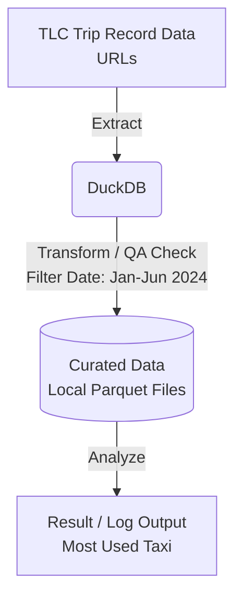

# NYC Taxi Data Pipeline (Submission 2)

## Overview
โปรเจกต์นี้คือ Data Pipeline สำหรับการดึง ทำความสะอาด และวิเคราะห์ข้อมูล NYC Taxi เพื่อหาคำตอบว่ารถแท็กซี่ประเภทใดถูกใช้งานมากที่สุดในช่วงครึ่งปีแรกของปี 2024

## Pipeline / Data Flow Diagram

## Data Pipeline Architecture
1. **Extract**: โหลดข้อมูลไฟล์ Parquet ผ่าน URL โดยตรงจากเว็บไซต์ TLC Trip Record Data
2. **Transform (Data Quality Check)**: ตรวจสอบและกรองข้อมูล โดยเลือกเฉพาะทริปที่มี pickup_datetime อยู่ในช่วง 1 ม.ค. 2024 ถึง 30 มิ.ย. 2024
3. **Load**: บันทึกข้อมูลที่ผ่านการทำความสะอาดแล้วลงในโฟลเดอร์ data/curated/ ในรูปแบบ Parquet
4. **Analyze**: อ่านข้อมูลทั้งหมดจากโฟลเดอร์ curated เพื่อประมวลผลหาผลรวมการใช้งานของรถแต่ละประเภท

## How to Run
1. สร้างและเปิดใช้งาน Virtual Environment: python -m venv venv และ source venv/bin/activate
2. ติดตั้งไลบรารี: pip install -r requirements.txt
3. รันคำสั่ง: python pipeline.py
4. ตรวจสอบสถานะการทำงานและคำตอบได้ที่ไฟล์ execution.log

## Design Decisions
1. **ใช้ DuckDB ในกระบวนการ ETL**: ตัดสินใจใช้ DuckDB เพราะสามารถรัน SQL query ดึงข้อมูลจากไฟล์ Parquet ต้นทางผ่าน URL ได้โดยตรง และประมวลผลแบบ in-memory ซึ่งจัดการกับข้อมูลขนาดใหญ่ได้ดีกว่าเครื่องมืออื่น
2. **การแยก Curated Data**: บันทึกข้อมูลที่คลีนแล้วเก็บไว้ เพื่อให้ Pipeline ทำงานซ้ำได้ โดยไม่ต้องโหลดใหม่จากเน็ตทั้งหมด และช่วยให้ได้ชุดข้อมูลพร้อมใช้สำหรับนำไปวิเคราะห์ต่อยอด

## Improvements from Submission 1
Submission 1 เป็นเพียงสคริปต์ดึงข้อมูลมานับจำนวนครั้งเดียวจบ แต่ใน Submission 2 ได้พัฒนากระบวนการเป็น Automated Pipeline มีการตรวจสอบ Data Quality เช่น การกรองวันที่หลุดกรอบ, มีระบบ Logging สำหรับตรวจสอบย้อนหลัง, และมีการทำ Exception Handling เพื่อให้ระบบทำงานต่อได้แม้ไฟล์ต้นทางจะมีปัญหา

## Learning Reflection & Limitations
ระหว่างการรัน Pipeline พบว่าข้อมูลบางประเภท เช่น Traditional FHV ไม่มีไฟล์อยู่บนเซิร์ฟเวอร์ต้นทาง (เกิด HTTP Error) แต่ด้วยการออกแบบ Pipeline ที่มีระบบ Fault Tolerance (try-except) ทำให้ระบบข้ามไปประมวลผลไฟล์อื่นต่อได้โดยไม่ Crash
